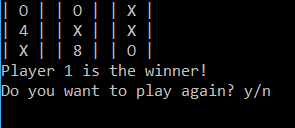
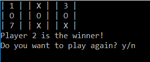
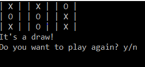

# Lab04-Tic-Tac-Toe

tell them what it is (with context, provide a summary)
show them what it looks like in action (Visuals)
show them how they use it (Step by step directions, “Happy Path” walk through)
tell them any other relevant details 

## Description
This application allows the user to play a basic tic-tac-toe game against a friend.  
To win the game you need to be the first person to get 3 of your icons in a row.
Here are some step by step directions for people who have never played before:
1. Choose who wants to be "X" and who wants to be "O"  
2. Have player "X" choose a tile and mark it with "X"  
3. Switch players  
4. Have player "O" choose a tile and mark it with "O"  
**Note, once a tile is marked with either "X" or "O", it can not be changed**  
5. Switch players
6. Do steps 2-5 again until there is a winner or there are no more tiles left to pick.  
7. If the board has 3 tiles in a row be the same icon, that player is the winner.  
7.5 If the board has no tiles left and no winner, then the game is a draw.  

This application is not for online multiplayer nor does it have an AI for singleplayer.  

## Visuals
Here are some examples of a completed game.  

Here is an example of how the board might look if the player with the "X" icon wins:  
  

Here is an example of how the board might look if the player with the "O" icon wins:  
  

Here is an example of how the board might look if the game ended in a draw:  
  

## How to use
1. Download Visual Studio  
2. Clone the repository [Lab04-Tic-Tac-Toe](https://github.com/jimmychang94/Lab04-Tic-Tac-Toe)  
3. Open Lab04-Tic-Tac-Toe.sln in Visual Studio  
4. In the Debug menu, click on the "Start Without Debugging" option  
5. Have the first player pick a name (they will be using the marker "X")  
6. Have the second player pick a name (they will be using the marker "O")  
7. Play the Tic-Tac-Toe game  

## Resources
Amanda's Lecture  